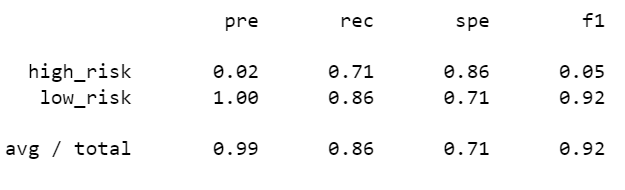
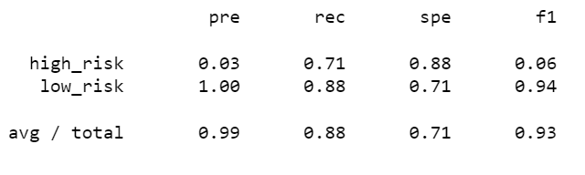
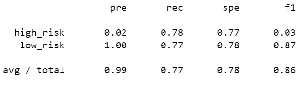
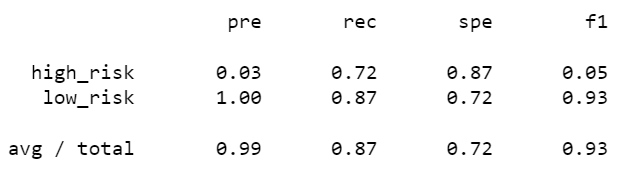
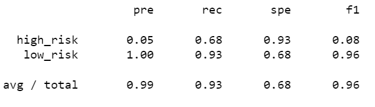
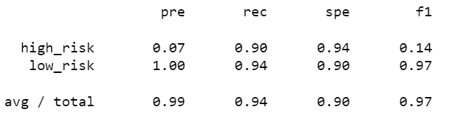
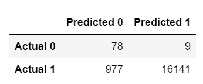

# Credit Risk Analysis

## Overview of the analysis
FastLearning, a peer-to-peer services company wants to use machine learning to predict credit risk. Several machine learning models are being evaluated to determine how well they perfom. The following results were obtained using the credit card credit dataset from LendingClub and imbalanced-learn and scikit-learn libraries.

## Results

### Naive Random Oversampling
- balanced acc score = 0.7856068022770949
- precision = 0.99
- recall = 0.86
- f1 = 0.92

### SMOTE Oversampling
- balanced acc score = 0.7966770207605626
- precision = 0.99
- recall = 0.88
- f1 = 0.93

### Undersampling using ClusterCentroids
- balanced acc score = 0.7742313998976678
- precision = 0.99
- recall = 0.77
- f1 = 0.86

### Combination (Over and Under) Sampling using SMOTEEN
- balanced acc score = 0.7976046589393702
- precision = 0.99
- recall = 0.87
- f1 = 0.93

### Balanced Random Forest Classifier
- balanced acc score = 0.8025107670490026
- precision = 0.99
- recall = 0.93
- f1 = 0.96

### Easy Ensemble AdaBoost Classifier
- balanced acc score = 0.91973864977781
- precision = 0.99
- recall = 0.94
- f1 = 0.97

## Summary
As can be seen above, the best performer is the AdaBoost Classifier, with the best balanced accuracy score, as well as f1. It is also the model returning the least false positives and false negatives, as can be seen in its confusion matrix:

However, with recall rates of 90% and 94% for each positive and negative detection, it may be worthwhile to explore if there are better predictive models, given that the AdaBoost Classifier would flag around 6% of low risk applications.